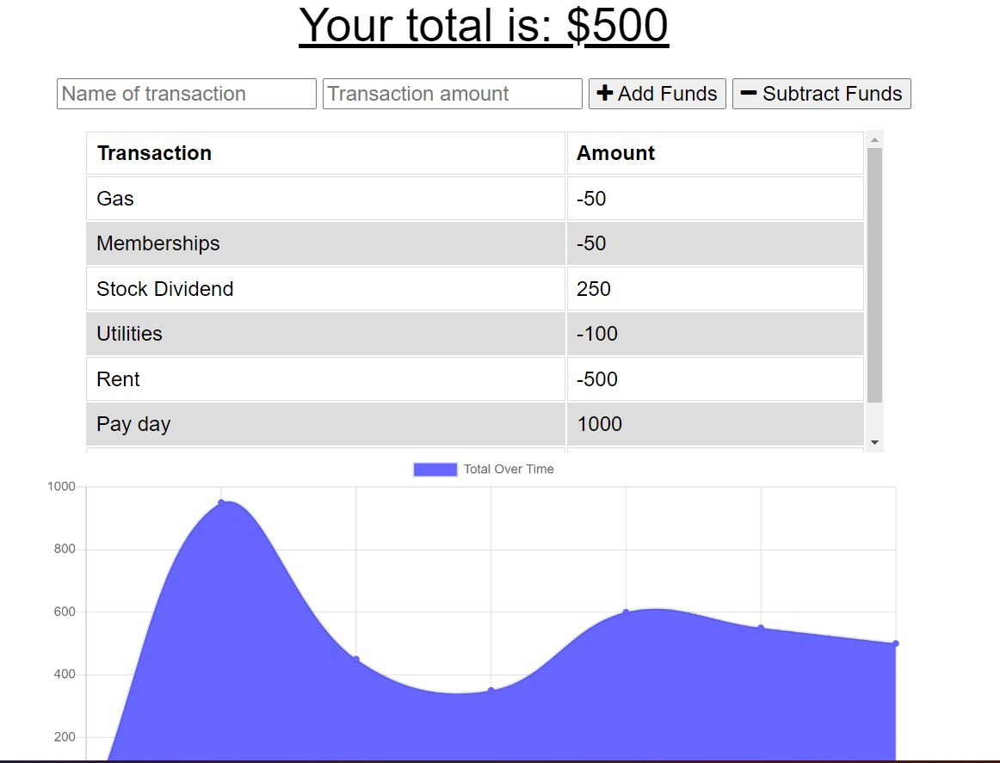

# Budget Tracker PWA

## Description

The purpose of this application is to create a simple to use budget app that allows users to track their credits and debits. This application is designed as a PWA (Progressive Web App) and allows the user to add budget transactions even without internet connectivity.

## Table of Contents

- [Installation](#installation)

- [License](#license)

- [Screenshot](#screenshot)

- [Questions](#questions)

## Installation

To install dependencies, run the below command:

    npm i

## License

This project is licensed under the MIT license.

## Screenshot

## Deployed Application Link

https://sleepy-badlands-07451.herokuapp.com/

## Questions

If you have questions about this repo, you can contact me at davistr1216@gmail.com. You can find more of my work on [GitHub](https://github.com/davistr)
